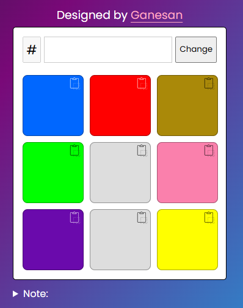

# 🎨 Color Check - Web Tool

A simple and clean color checker built with **HTML**, **CSS**, and **JavaScript**. Enter any hex color code to instantly preview it and copy it with ease. Perfect for developers, designers, or anyone working with color.

---

## 🔗 Live Demo

👉 [Check it out here](https://your-username.github.io/color-check)

---

## 🧠 How It Works

- Enter a **hex color code** (e.g., `#ff5733`)
- Click the **Change** button to apply the color
- The selected color is displayed in the boxes below
- A message "Copied!" appears when a color is clicked (assumed clipboard feature)

---

## 📸 Preview

---

## 🚀 Features

✅ Dynamic color preview  
✅ Compare colors visually across multiple boxes  
✅ Responsive layout with clean design  
✅ Copy feedback animation ("Copied!")  
✅ Built without frameworks – just pure HTML/CSS/JS  
✅ Easy to use, mobile-friendly UI

---

## 🛠️ Tech Stack

- **HTML5**
- **CSS3**
- **JavaScript**

---

## 👨‍💻 Author

**Ganesan**

### 
🎉 Thanks for checking it out! Happy coloring! 😊

