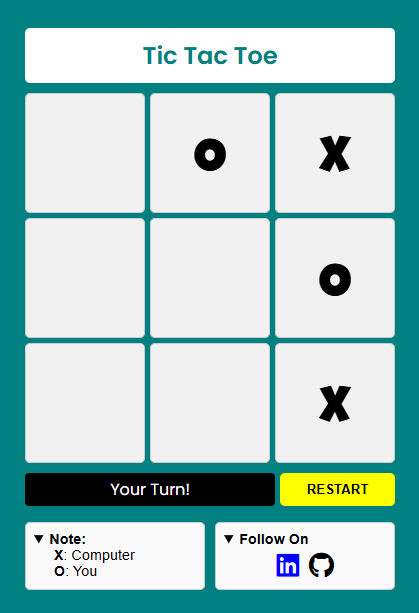

# 🎮 Tic Tac Toe - Web Edition

A simple, stylish Tic Tac Toe (X/O) game built with **HTML**, **CSS**, and **JavaScript**. Challenge yourself against a smart computer opponent and enjoy a clean, responsive interface.

---

## 🔗 Live Demo

👉 [Check it out here](https://your-username.github.io/tic-tac-toe)

---

## 🧠 How It Works

- **Computer** plays as `X` (auto move)
- **You** play as `O` (manual click)
- First to get 3 in a row wins
- If all squares are filled without a winner → Draw!
- Restart the game anytime using the **Restart** button

---

## 📸 Preview

---

## 🚀 Features

✅ Computer AI for automated moves  
✅ Stylish fonts & responsive layout  
✅ Clean and simple UI  
✅ Easy-to-read code  
✅ No frameworks – Pure HTML/CSS/JS

---

## 🛠️ Tech Stack

- **HTML5**
- **CSS3**
- **JavaScript**

## 👨‍💻 Author

**Ganesan**

### 
🙏 Thank You for Visiting! 😊

