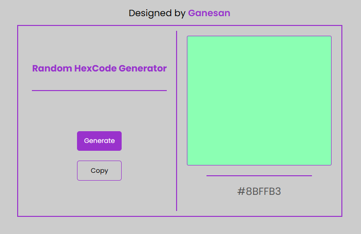

# 🎨 Random HexCode Generator

## A simple web application that generates random hexadecimal color codes and allows you to copy them to your clipboard.

## Live Demo

## [Click Here](https://gane-an.github.io/Projects/2-generate-random-color/)

## Sample Screenshot



## Features

- Generates random 6-digit hexadecimal color codes
- Visual display of the generated color
- One-click copy functionality
- Responsive design that works on both desktop and mobile devices
- Clean and minimalist UI

## Technologies Used

- HTML5
- CSS3 (with modern features like nesting)
- JavaScript (ES6)

## How to Use

1. Click the "Generate" button to create a random hex color code
2. The color will be displayed in the preview box
3. Click "Copy" to copy the hex code to your clipboard
4. A notification will appear confirming the copy action

## Installation

No installation required - simply open the `index.html` file in any modern web browser.

## Project Structure

```bash
random-hexcode-generator/
├── index.html          # Main HTML file
├── style.css           # Stylesheet
└── script.js           # JavaScript functionality
```
